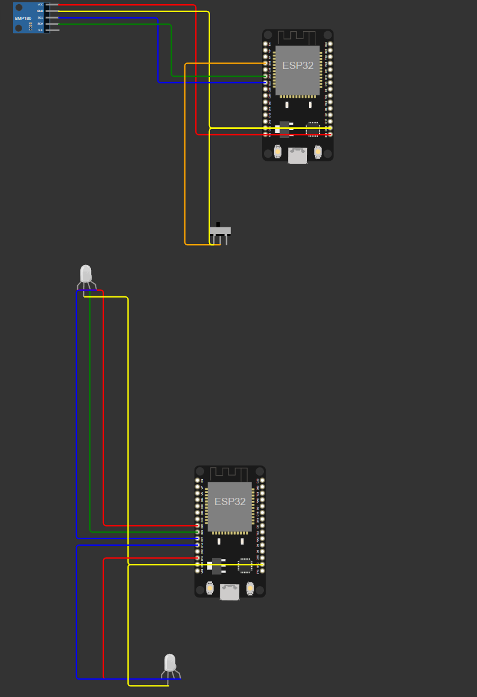
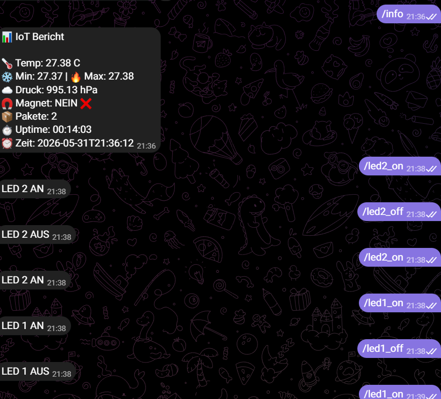

# IoT Wetterstation – SYT Projekt

Verfasser: **CLeckIn** & **lukamlnvc11311***

Datum: **27.06.2026**

## 1. Einführung

Dieses Projekt entstand im Rahmen des SYT-Unterrichts (Systemtechnik) und demonstriert eine vollständige IoT-Anwendung mit zwei ESP32-Mikrocontrollern. Ziel war es, ein eingebettetes System zu entwickeln, das Sensordaten kabellos überträgt, visuell anzeigt und über mehrere Schnittstellen (Webseite, Telegram) abrufbar macht.

## 2. Projektbeschreibung

Das System besteht aus zwei ESP32-Boards, die über das **ESP-NOW**-Protokoll miteinander kommunizieren:

### Sender-ESP32

* Liest **Temperatur** und **Luftdruck** vom *BMP280*-Sensor (I²C)
* Liest den **Magnetstatus** vom *LM393*-Hallsensor (Digital-I/O)
* Nutzt den **Deep Sleep Mode**: Wacht alle 15 Sekunden auf, sendet ein Datenpaket und schläft wieder.

```cpp
typedef struct struct_message {
    float temp;      // Temperatur in °C
    float press;     // Luftdruck in hPa
    bool  magnet;    // true = Magnet in der Nähe
} struct_message;
```

### Empfänger-ESP32

* Empfängt die ESP-NOW-Datenpakete
* Verbindet sich mit WLAN (Auto-Konfiguration via **WiFiManager**)
* Synchronisiert die Uhrzeit per **NTP**
* Betreibt ein **Web-Dashboard** (Dark Mode, Port 80)
* Unterstützt einen **Telegram-Bot** (`/info`-Befehl)
* Steuert **zwei RGB-LEDs** zur Statusanzeige

## 3. Theorie

### ESP-NOW

ESP-NOW ist ein von Espressif entwickeltes Peer-to-Peer-Kommunikationsprotokoll für ESP8266 und ESP32. Es ermöglicht die direkte Datenübertragung zwischen zwei Geräten ohne einen WLAN-Router. Die Übertragung erfolgt auf dem 2,4-GHz-Band.

Vorteile gegenüber klassischem WiFi:
- Sehr geringe Latenz (< 10 ms)
- Kein Router notwendig
- Geringer Stromverbrauch
- Einfache Implementierung mit der `esp_now`-Bibliothek

### BMP280

Der *Bosch BMP280* ist ein digitaler Umgebungssensor, der Temperatur (−40 bis +85 °C) und absolute Luftdruck (300–1100 hPa) misst. Die Kommunikation erfolgt über I²C oder SPI. Im Projekt wird die I²C-Variante mit der Adafruit-Bibliothek verwendet.

### LM393 Hallsensor

Das LM393-Modul enthält einen Halleffekt-Sensor und einen Komparatorchip. Der Digitalausgang (DO) wechselt auf LOW, sobald ein Magnet in die Nähe des Sensors gebracht wird. Damit lässt sich z. B. das Öffnen und Schließen einer Tür oder eines Fensters erkennen.

### WiFiManager

Die *WiFiManager*-Bibliothek (by tzapu) ermöglicht es, WLAN-Zugangsdaten ohne Hardcodierung zu konfigurieren. Bei der ersten Inbetriebnahme (oder wenn das gespeicherte Netzwerk nicht erreichbar ist) öffnet der ESP32 einen eigenen WLAN-Accesspoint mit einem Konfigurationsportal. Der Nutzer verbindet sich damit und gibt die Zugangsdaten ein.

### LED 1 – Magnetstatus

| Zustand               | Farbe          |
|-----------------------|----------------|
| Magnet erkannt        | 🟢 Grün         |
| Kein Magnet           | 🔴 Rot          |
| Sender offline        | 🔴 Rot          |

### LED 2 – Systemstatus

| Zustand                          | Farbe                  |
|----------------------------------|------------------------|
| Temperatur normal (<= 28 °C)     | 🔵 Blau                |
| Temperatur hoch (> 28 °C)        | 🔴 Rot                 |
| Sender seit > 30 s offline       | 🔴 Rot (blinkend)      |

## 4. Arbeitsschritte

1. **Checken ob alle physikalischen [Komponenten](.docs/components.md) vorhanden sind**

2. **New Sketch in der Arduino IDE**

3. **Bibliotheken in der Arduino IDE installieren**  
   Über *Sketch → Bibliotheken verwalten*:
   - Adafruit BMP280
   - WiFiManager (by tzapu)
   - UniversalTelegramBot
   - ArduinoJson
    
4. **MAC-Adresse des Empfängers ermitteln**
   
    Dazu den darunter angeführten code ausführen und die MAC-Addresse kopieren.
   
     ```cpp
     #include <WiFi.h>
     
     void setup() {
       Serial.begin(115200);
       WiFi.mode(WIFI_STA);
       delay(500);
       Serial.println(WiFi.macAddress());
     }
     
     void loop() {}
    ```

5. **MAC-Adresse im Sender eintragen**  
   Die MAC-Addresse kopieren vom output des obigen codes und in die eckigen klammern in ```uint8_t receiverAddress[]``` eintragen.

6. **Sender-Sketch hochladen** auf den Sender-ESP32

7. **Empfänger-Sketch hochladen** auf den Empfänger-ESP32

8. **Telegram Bot-Token und Chat-ID eintragen**  

9. **WLAN konfigurieren**  
   Gib deine WLAN-Daten ein. (Name des WLAN's und das dazugehörige passwort).

10. **Dashboard aufrufen**  
   Öffne im Browser die IP-Adresse des Empfängers (z. B. `http://192.168.1.42`).

### Code

#### Sender-Konfiguration (`src/Sender.ino`)

| Abschnitt           | Erklärung                                                                 |
|---------------------|---------------------------------------------------------------------------|
| `struct_message`    | Datenstruktur, die per ESP-NOW übertragen wird                            |
| `receiverAddress[]` | MAC-Adresse des Empfängers – muss manuell eingetragen werden              |
| `setup()`           | Initialisiert BMP280, Hall-Pin, WiFi (Kanal 11) und ESP-NOW               |
| `loop()`            | Bleibt leer, da Messung und Deep Sleep im setup() erfolgen                |
| `OnDataSent()`      | Callback nach erfolgtem Sendeversuch – startet den Deep Sleep             |

**Wichtige Robustheits-Maßnahme:** Vor dem Senden werden die BMP280-Werte auf Erfolg geprüft. Falls der Sensor nicht gefunden wird, werden Standardwerte gesendet.

| Variable | Wert | Beschreibung |
|----------|------|-------------|
| `uS_TO_S_FACTOR` | `1000000ULL` | Umrechnungsfaktor Mikrosekunden → Sekunden |
| `TIME_TO_SLEEP` | `15` | Sleep-Dauer in Sekunden |
| `receiverAddress[]` | `{0x20, 0xE7, 0xC8, 0x67, 0x76, 0xB0}` | MAC-Adresse des Empfängers (manuell eintragen) |
| `I2C_SDA` | `32` | GPIO-Pin für I²C Datenleitung (BMP280) |
| `I2C_SCL` | `33` | GPIO-Pin für I²C Taktleitung (BMP280) |
| `HALL_PIN` | `34` | GPIO-Pin für Hall-Sensor Eingang |


#### Empfänger-Konfiguration (`src/Receiver.ino`)

| Abschnitt              | Erklärung                                                                    |
|------------------------|------------------------------------------------------------------------------|
| `OnDataRecv()`         | ESP-NOW Callback – kopiert Daten in incomingData und setzt Zeitstempel       |
| `handleRoot()`         | Erzeugt dynamisches HTML-Dashboard (Dark Mode) mit aktuellen Sensordaten     |
| `updateLEDs()`         | Setzt LED 1 und LED 2 basierend auf Magnet- und Temperaturstatus             |
| `handleNewMessages()`  | Verarbeitet `/info`-Befehle des Telegram-Bots                                |
| `loop()`               | Abarbeiten von Webserver, LED-Update und Telegram-Abfrage                    |

**Wichtige Robustheits-Maßnahme:** Der Empfänger nutzt einen Timeout von 30 Sekunden. Da der Sender alle 15 Sekunden sendet, wird so ein Ausfall sicher erkannt.

**LED 1 – Magnetstatus**

| Pin-Typ | GPIO | Farbe | Funktion |
|---------|------|-------|----------|
| `L1_R` | 25 | Rot | Rote Komponente der Magnet-Status-LED |
| `L1_G` | 26 | Grün | Grüne Komponente der Magnet-Status-LED |

**LED 2 – Systemstatus**

| Pin-Typ | GPIO | Farbe | Funktion |
|---------|------|-------|----------|
| `L2_R` | 13 | Rot | Rote Komponente der System-Status-LED |
| `L2_B` | 14 | Blau | Blaue Komponente der System-Status-LED |

**Schwellwerte und Timeouts**

| Konstante | Wert | Einheit | Beschreibung |
|-----------|------|--------|-------------|
| `Temperatur-Grenze` | `28.0` | °C | Obergrenze normale Temperatur → LED2 Rot |
| `lastRx Timeout` | `30000` | ms | Zeit bis Sender als offline gilt (Blinken) |
| `lastBotCheck` | `2000` | ms | Abfrage-Intervall Telegram-Bot |
| `Blink-Frequenz` | `500` | ms | Blinkgeschwindigkeit bei Offline-Status |

**Webserver**

| Parameter | Wert | Beschreibung |
|-----------|------|-------------|
| Port | `80` | HTTP-Port für Web-Dashboard |
| Auto-Refresh | `5` Sekunden | Dashboard aktualisiert sich automatisch |
| Design | Dark Mode | Dunkles Design mit CSS-Styling |

**Telegram Bot**

| Befehl | Funktion | Antwort |
|--------|----------|--------|
| `/info` | Aktuelle Daten anzeigen | Temperatur, Druck, Magnetstatus, Zeit |
| `/start` | Bot initialisieren | Willkommensnachricht |


### Datenflussbeschreibung

```
[BMP280 / LM393]
      │
      ▼
[Sender ESP32] ──ESP-NOW (Kanal 11)──► [Empfänger ESP32]
                                               │
                    ┌──────────────────────────┼──────────────────────────┐
                    ▼                          ▼                          ▼
              [Webserver]                [Telegram Bot]               [RGB LEDs]
                (Port 80)                  (/info)                    (Status)
                    
                    
            
```

### Bilder und Schaltungen

**Schaltplan**



### Technische Beschreibung des Schaltplans

Der Hardware-Aufbau besteht aus zwei funktional getrennten Einheiten: einer **Sender-Station** zur Messwerterfassung und einer **Empfänger-Station** zur Visualisierung. Die Kommunikation zwischen den beiden Knoten erfolgt kabellos über ESP-NOW.

1. Sender-Station
    An der Sender-Station wurden die Sensoren zur Erfassung der Umwelt- und Sicherheitsdaten angebunden. Da die Pins auf der rechten Seite des ESP32 durch das Breadboard verdeckt sind, wurde die gesamte Beschaltung auf die linke Seite verlegt.
    
    *   **BMP280 (Umweltsensor):** Die Kommunikation erfolgt über den I2C-Bus. Hierbei wurde der Daten-Pin (SDA) an **GPIO 32** und der Takt-Pin (SCL) an **GPIO 33** angeschlossen. Die Spannungsversorgung erfolgt über den 3V3-Pin des Mikrocontrollers.
    *   **Hall-Sensor (Magnetfeld-Simulation):** Ein Hallsensor ist an **GPIO 34** angeschlossen. Das Modul liefert ein digitales Signal, das vom ESP32 ausgewertet wird.

2. Empfänger-Station
    Die Empfänger-Station dient als Gateway und stellt die empfangenen Daten visuell dar. Hierzu wurden zwei RGB-LEDs (Common Cathode) mit entsprechenden Vorwiderständen (220 Ω) integriert:
    
    *   **LED 1 (Magnet-Status):** Diese LED signalisiert den Zustand des Hall-Sensors am Sender. Sie ist an den Pins **GPIO 25 (Rot)** und **GPIO 26 (Grün)** angebunden.
    *   **LED 2 (System-Status):** Zur Anzeige der Temperaturwarnungen und Kommunikationsfehler wurden die Pins **GPIO 13 (Rot)** und **GPIO 14 (Blau)** verwendet. 
    *   **Masseverbindung:** Alle Kathoden der LEDs sowie die Sensoren sind mit dem gemeinsamen Masse-Potenzial (GND) des jeweiligen ESP32 verbunden.

**Dashboard-Screenshot:**

  

Im Dashboard kann man die Messwerte sehen und die beiden Status-LED's ein- und auschalten.

**Telegram-Screenshot:** 



Mit /info werden die Daten der Wetterstation angezeigt.

**Projekt Aufbau**


## 5. Zusammenfassung

In diesem Projekt wurde eine vollständige IoT-Wetterstation mit zwei ESP32-Mikrocontrollern entwickelt. Der Sender erfasst Temperatur, Luftdruck und Magnetstatus und überträgt die Daten drahtlos per ESP-NOW. Der Empfänger verarbeitet die Daten, stellt sie über ein Web-Dashboard bereit, ermöglicht Telegram-Abfragen und zeigt den Systemstatus über RGB-LEDs an.

Das Projekt demonstriert praxisrelevante Konzepte der eingebetteten Systemtechnik:
- Drahtlose Kommunikation (ESP-NOW)
- Sensorintegration (I²C, Digital-I/O)
- Netzwerkdienste (WiFi, NTP, HTTP)
- Sichere Konfigurationsverwaltung (Secrets-Datei, .gitignore)
- Robuste Fehlerbehandlung (Paketgrößenvalidierung, Plausibilitätsprüfung)

## 6. Quellen

[1] Espressif Systems, "ESP-NOW," *Espressif Docs*. [online]. Available at: https://docs.espressif.com/projects/esp-idf/en/latest/esp32/api-reference/network/esp_now.html. 

[2] Bosch Sensortec, "BMP280 Digital Pressure Sensor," *Bosch Sensortec*. [online]. Available at: https://www.bosch-sensortec.com/products/environmental-sensors/pressure-sensors/bmp280/.

[3] tzapu, "WiFiManager," *GitHub*. [online]. Available at: https://github.com/tzapu/WiFiManager.
